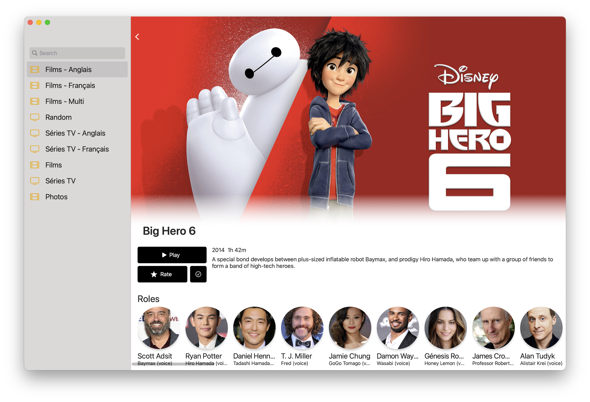

# NativePlex
This is an attempt at creating a native Plex player for macOS/iPadOS/iOS. 
Why did I create this ?
- Free / Opensource alternative to the iOS client
- Performance
- Native / Apple look and feel
- Learning purpose
- Inspired by this [great plex design reddit post](https://www.reddit.com/r/PleX/comments/nvcr6s/i_started_working_on_a_nativefeel_plex_client_ui/) 

The project was never finished but it can already do basics things. I probably won't be working on it unless many people show interest. However I will gladly accept any valid PRs.

## Screenshots
Design heavily inspired by this [reddit post](https://www.reddit.com/r/PleX/comments/nvcr6s/i_started_working_on_a_nativefeel_plex_client_ui/) .

| | |
| ------------- | ------------- |
| | |

## Features
 - Login using your Plex account
 - List account librairies for movies and series
 - Show some details about a movie
 - Play videos supported by AVFoundation codecs (only direct file streaming -> [codec list](https://developer.apple.com/documentation/avfoundation/avvideocodectype))
 - Picture in picture and all the features coming with the default AVPlayer (subtitles, sound track selection, ...)

## Todo
- Stream encoded video stream
- Support other codecs with [VLCKit](https://code.videolan.org/videolan/VLCKit)
- UI polishing
- Local caching
- Played / unplayed button
- Restart from timestamp
- Rate movie button
- Edit button
- Other librairies type (pictures, ...)

## Contribute
Feel free to create PRs I will gladly review and accept them.
